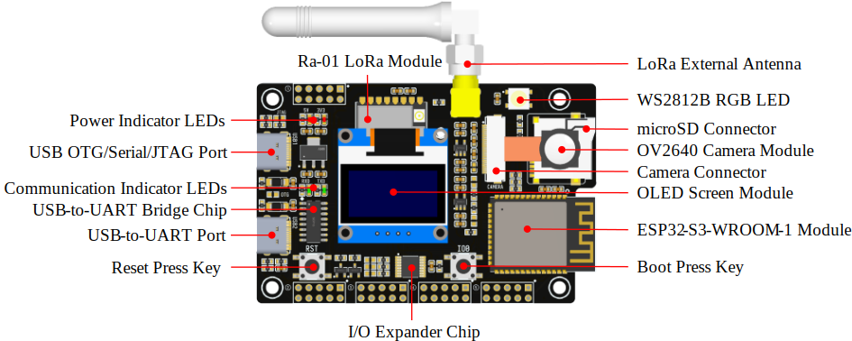

# Mobinets IoT Testbed v1.0

Mobinets IoT Testbed 是一款基于 ESP32-S3-WROOM-1 与 Ra-01 模组的物联网开发板，支持通过 LoRa、Wi-Fi、蓝牙等协议通信。同时搭载了 OLED 屏幕、摄像头、microSD 卡等外设。

Mobinets IoT Testbed 开发板主要由以下几个部分组成：

- 主板：Mobinets IoT Testbed
- OLED 屏幕模块
- microSD 卡
- 外置天线
- 摄像头

本文档包括如下内容：

- 入门指南：简要介绍了开发板和硬件、软件设置指南。
- 硬件参考：详细介绍了开发板的硬件。
- 软件参考：详细介绍了开发板的软件编写。
- 相关文档：列出了相关文档的链接。

## 入门指南

本小节将简要介绍 Mobinets IoT Testbed，说明相关准备工作及如何烧录固件。

### 组件介绍

下面将按照顺时针的顺序依次介绍开发板上的主要组件。

主要组件 | 介绍
-- | --
USB-to-UART 端口 (USB-to-UART Port) | 用于 PC 端与 ESP32-S3-WROOM-1 模组的通信。
USB-to-UART 桥接器 (USB-to-UART Bridge Chip) | 单芯片 USB-UART 桥接器 CH340C 为软件下载和调试提供高达 2 Mbps 的传输速率。
通信指示 LED (Communication Indicator LEDs) | 两个通用 LED（黄绿色），指示 USB-to-UART 端口双向通信状态。
USB OTG/串口/JTAG 控制器端口 (USB OTG/Serial/JTAG Port) | 连接至 ESP32-S3 集成的 USB 串口/JTAG 控制器以及符合 USB 2.0 规范的全速 USB OTG 外设。使用 JTAG 和 OTG 功能时需要短接对应的跳线点。
电源指示 LED (Power Indicator LEDs) | 两个通用 LED（红色），指示 5V 与 3.3V 电压是否正常。
Ra-01 LoRa 模组 (Ra-01 LoRa Module) | 基于 SX1278 系列芯片设计开发的 LoRa 远程调制解调器，用于超长距离扩频通信，抗干扰性强，能够最大限度降低电流消耗。
LoRa 外置天线 (LoRa External Antenna) | 433 MHz 胶棒天线，增益 3dBi。
WS2812B 全彩色 LED 灯 (WS2812B RGB LED) | 集控制电路与发光电路于一体的 LED 光源，采用单线归零码的通讯方式。
microSD 连接器 (microSD Connector) | 可安装支持 SPI 总线模式的 microSD 卡进行数据存储或读取。
OV2640 摄像头模组 (OV2640 Camera Module) | OV2640 摄像头模组使用 2 百万像素的低电压 CMOS 传感器，使用 SCCB 接口控制。
摄像头连接器 (Camera Connector) | 用于安装 OV2640 摄像头模组，安装后可使用双面胶将摄像头模组贴在 microSD 连接器上。
OLED 屏幕模组 (OLED Screen Module) | 使用 SSD1306/SSD1315 驱动的 128x64 OLED 屏幕模块，安装在 2.54mm 间距 4-pin 排母上，使用 I2C 总线通信。
ESP32-S3-WROOM-1 模组 (ESP32-S3-WROOM-1 Module) | 通用型 Wi-Fi + 低功耗蓝牙 MCU 模组，搭载 ESP32-S3 系列芯片。板载的 ESP32-S3-WROOM-1-N16R8 提供 16MB Flash 与 8MB PSRAM。
I/O 扩展器芯片 (I/O Expander Chip) | 扩展 8 个通用 I/O，使用 I2C 总线通信。
Boot/Reset 按键 (Boot/Reset Press Keys) | 单独按下 Reset(RST) 按键会重置系统；长按 Boot(IO0) 键时，再按 Reset(RST) 键可启动固件上传模式，然后便可通过串口上传固件。

### 开始开发应用

通电前，请确保开发板完好无损。

#### 必备硬件

- 1 x Mobinets IoT Testbed v1.0
- 1 x USB 2.0 数据线（标准 A 型转 C 型）
- 1 x LoRa 天线
- 1 x 电脑（Windows、Linux 或 macOS）

*请确保使用适当的 USB 数据线。部分数据线仅可用于充电，无法用于数据传输和编程。*

#### 可选硬件

- 1 x microSD 卡
- 1 x OLED 模块
- 1 x 摄像头模块

#### 硬件设置

1. 连接 LoRa 天线至 RF 射频同轴连接器。
2. 插入 USB 数据线，连接 PC 与开发板的 USB2 端口。
3. 此时，两个红色指示灯应亮起。

#### 软件设置

1. 使用 `Visual Studio Code` 打开示例工程。
2. 安装 `PlatformIO IDE` 扩展。
3. 确保当前工程环境为 `env:default`，并且 `src_dir = src/basic`。
4. 点击 `Upload` 按钮，将示例程序上传到开发板。

## 硬件参考

### 功能框图

Mobinets IoT Testbed v1.0 的主要组件和连接方式如下图所示。

// TODO

### 供电说明

主电源为 5 V，由 USB 提供。两个 USB 接口仅能向开发板供电，默认不能对外部供电。也可以通过扩展排针的 VIN 和 GND 引脚进行 5V 电压供电。

### GPIO 分配列表

下表为 ESP32-S3-WROOM-1 模组管脚的 GPIO 分配列表，用于控制开发板的特定组件或功能。

ESP32-S3-WROOM-1 GPIO 分配：

管脚名称 | 摄像头 | 通信总线 | 按键 | 模块 | 其他
-- | -- | -- | -- | -- | --
EN | | | RST_KEY
IO0 | | | IO0_KEY
IO1 | | | | | 排针: GPIO
IO2 | | | | | 排针: GPIO
IO3 | Y5/D3
IO4 | | SPI: MISO
IO5 | | SPI: MOSI
IO6 | | | | | 排针: GPIO
IO7 | | | | | 排针: GPIO
IO8 | | | | | 排针: GPIO
IO9 | | | | microSD: CS
IO10 | | | | Ra-01: CS
IO11 | PCLK
IO12 | Y6/D4
IO13 | Y2/D0
IO14 | Y4/D2
IO15 | | | | Ra-01: DIO0
IO16 | | | | Ra-01: DIO1
IO17 | | I2C: SDA
IO18 | | I2C: SCL
IO19 | | USB: DN
IO20 | | USB: DP
IO21 | VSYNC
IO35 | | | | | Reserve
IO36 | | | | | Reserve
IO37 | | | | | Reserve
IO38 | HREF
IO39 | Y9/D7
IO40 | XCLK
IO41 | Y8/D6
IO42 | Y7/D5
IO43 | | UART: TXD0
IO44 | | UART: RXD0
IO45 | | | | RGB: WS2812B
IO46 | | | | | Reserve
IO47 | Y3/D1
IO48 | | SPI: SCK

分配给 IO 扩展器的 GPIO 被近一步分配为多个 GPIO。

IO 扩展器 GPIO 分配：

管脚名称 | 功能
-- | --
P0 | 排针: GPIO
P1 | 排针: GPIO
P2 | 排针: GPIO
P3 | 排针: GPIO
P4 | 排针: GPIO
P5 | 摄像头: PWDN
P6 | 摄像头: RESET
P7 | Ra-01: NRST

### 硬件设置选项

#### 自动下载

可以通过两种方式使 ESP 开发板进入下载模式：

- 由软件自动执行下载。软件利用串口的 DTR 和 RTS 信号来控制 ESP 开发板的 EN、IO0 管脚的状态。
- 手动按下 Boot(IO0) 和 Reset(RST) 键，然后先松开 Reset(RST)，再松开 Boot(IO0) 键。

开发板硬件支持由软件自动执行下载。如需使用串口监视器，需要禁用 DTR 和 RTS 信号，否则会在打开串口监视器时进入下载模式。

#### JTAG

// TODO

#### OTG

// TODO

## 软件参考

// TODO

## 相关文档

- ESP32-S3 技术规格书 [CN](https://www.espressif.com/sites/default/files/documentation/esp32-s3_datasheet_cn.pdf) [EN](https://www.espressif.com/sites/default/files/documentation/esp32-s3_datasheet_en.pdf)
- ESP32-­S3 技术参考手册 [CN](https://www.espressif.com/sites/default/files/documentation/esp32-s3_technical_reference_manual_cn.pdf) [EN](https://www.espressif.com/sites/default/files/documentation/esp32-s3_technical_reference_manual_en.pdf)
- ESP32-S3-WROOM-1/1U 技术规格书 [CN](https://www.espressif.com/sites/default/files/documentation/esp32-s3-wroom-1_wroom-1u_datasheet_cn.pdf) [EN](https://www.espressif.com/sites/default/files/documentation/esp32-s3-wroom-1_wroom-1u_datasheet_en.pdf)
