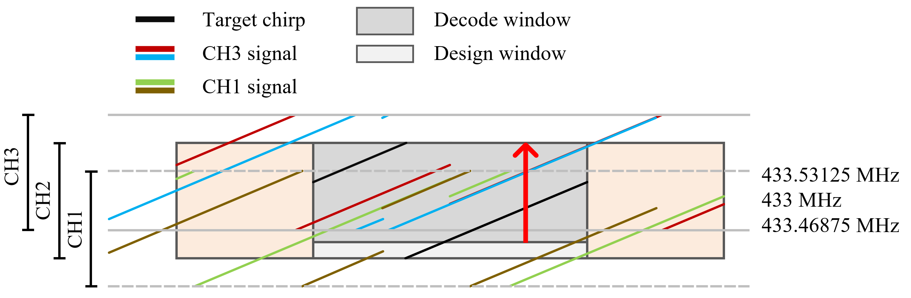

# 相同带宽的非正交重叠信道解码

## Methods

1. 自下而上扫描窗口内的信号，目标 chirp 峰值应该是连续的线性增长。

2. 首先对整个目标窗口做 de-chirp，得到候选峰，滑动窗口自左向右，做差值剔除掉各个非正交的候选峰。

## 实验设计

> **Channel 1**：
>
> - 中心频率：433.46875 MHz
> - 频带范围：
>
> **Channel 2**：
>
> - 中心频率：433.5 MHz
> - 频带范围：
>
> **Channel 3**：
>
> - 中心频率：433.53125 MHz
> - 频带范围：

### Payload

1. 实验发送的数据：helloworldloraexp

   - Channel 1 Bin 值：[810, 1010, 386, 614, 850, 406, 126, 1022, 367, 677, 347, 284, 27, 551, 991, 990, 49, 827, 822, 85, 265, 587, 421]

   - Channel 2 Bin 值：[810, 1010, 386, 614, 850, 406, 126, 1022, 367, 677, 347, 284, 27, 551, 991, 990, 49, 827, 822, 85, 265, 587, 421]
   - Channel 3 Bin 值：[810, 1010, 386, 614, 850, 406, 126, 1022, 367, 677, 347, 284, 27, 551, 991, 990, 49, 827, 822, 85, 265, 587, 421]

### 文件目录

- 虚拟机共享文件夹：\\192.168.3.102\e\share\samples\

- Channel 2 信道无冲突路径：\\192.168.3.102\e\data\channel2_231220\

- Channel 1/3 发送数据时间分别偏移 50/100 ms：\\192.168.3.102\e\data\delay_231219\

- Channel 1/2/3无时间偏移：\\192.168.3.102\e\data\nodelay_231219\

### 实验记录

CIC 解码结果：

 CH1 payload1: 失败（该信道能量较低，可能被直接滤掉了）

 CH2 payload1: [810 722 386 614 850 593 126 1022 842 677 347 862 581 551 574 113 806 827 822 85 421 587 421]

 CH3 payload2: [810 1010 386 614 850 406 126 1022 367 677 347 284 27 551 1004 1006 49 836 822 85 265 587 421]

准确率：0/23 14/23 20/23  

1. - **问题**：提出一个新的解决方案后，直接通过实验验证难度大，可行性低
   - **答**：编写单 Chirp 信号仿真平台，包括 downchirp、baseupchirp、冲突 chirp 和非正交冲突 chirp 的生成，在此平台上进行方法的可行性验证。
2. - **问题**：实验中发现不同硬件解码的 Bin 值不一致
   - **答**：nf95 由于接口配置问题，在实际使用中不同硬件解码的 Bin 值不一致，改换 Radiolib 库并且在每次 setup 阶段 reset 对应的接口。
3. - **问题**：难以控制不同节点发送数据产生冲突
   - **答**：编写发送端程序，通过 1 个节点控制 3 个节点分别在 Channel 1、2、3 发送数据。
4. - **问题**：实现一控多之后，发现节点几乎同时发送数据
   - **答**：Channel 1 发送数据时间偏移 50 ms，Channel 3发送数据时间偏移 100 ms
5. - **问题**：量哥指出直接进行 3 个非正交信道的解码工作实现难度大
   - **答**：可以先考虑两个非正交信道的解码，例如原信道 Channel 1 占带宽 125 KHz，此时增加 50 KHz 带宽，即可划分两个非正交信道 Channel 1 和 2。即通过增加少量的带宽资源可实现更多信道的划分。
6. - **问题**：互相关性能否用在 SFD 的检测中？
   - **答**：参考 CIC 方法
7. - **问题**：由于信号是含正负方向的，滤波器无法滤掉指定的频率
   - **答**：
8. - **问题**：连续线性变化计算开销大，是否可以从频率角度直接考虑两个窗口的交集
   - **答**：
9. - **问题**：切分的滑动窗口，de-chirp 结果存在峰值偏移的问题
   - **答**：是否可以通过设置置信区间解决该问题
10. - **问题**：（240112 量哥）可以用三种 downchirp：1.只在信道 1 未重叠部分的 downchirp；2. 只在信道2未重叠的 downchirp； 3. 只在信道 1 和信道 2 重叠部分的 downchirp
    - **答**： 不可行；过滤掉频谱的
11. 重要：*网关侧采集不同设备发送的 payload 会产生不同的 CFO/FFO，非正交重叠信道本质上就是频率偏移。*
    - CH1-2-3 CIC 解：能解出 CH2-3，CH1 因为能量较低被过滤
    - CH2-3-1 CIC 解：能解出 CH2-3，CH1 检测不到

